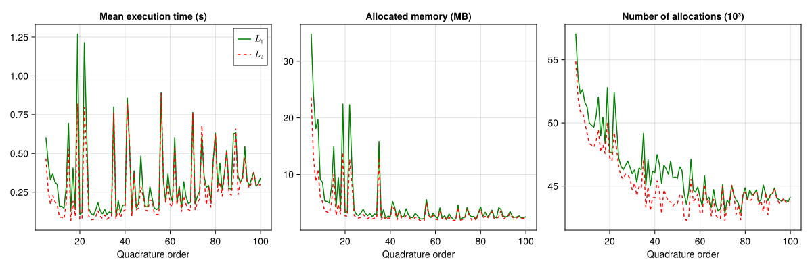
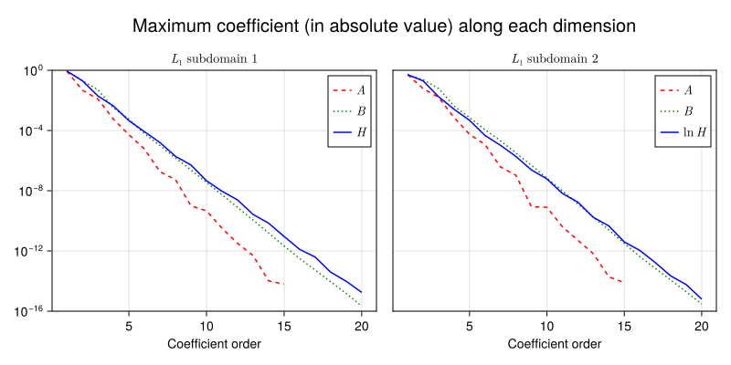
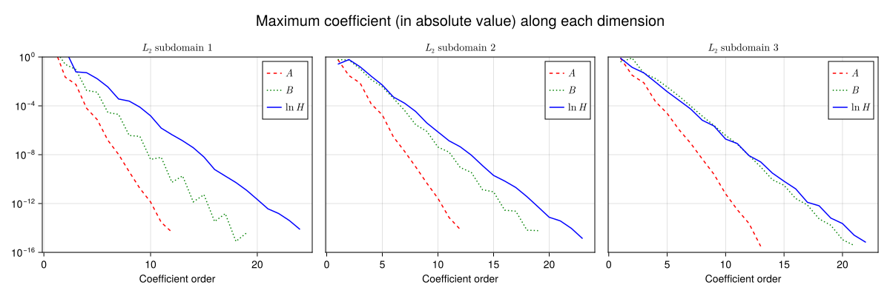

# Chebyshev coefficients
The integrals $L_1$ and $L_2$ are the main objects of approximation by Chebyshev series in WaveGreen2D. Their analytical expressions are given in detail [here][wavegreen2d]. Their numerical evaluation in Julia, with the [QuadGK.jl] package, required some experiments due to the singular nature of the integrands.

The numerical experiment was performed with [BenchmarkTools.jl], and studied how the quadrature `order`, parameter of [`quadgk`][quadgk], influences execution time, memory allocated and number of allocations. Each quadrature was executed for 1000 random points in the domain of interest, and the averages are presented in the following image, created with [Makie.jl].

    

From the plot above, it can be concluded that the optimal value of quadrature order ranges between 24 and 34. This experiment lead to a slight modification in the evaluation process of the intetrals $L_1$ and $L_2$ for the purpose of obtaining the Chebyshev coefficients. The integrals are computed with the `order` parameter of `quadgk` varying in the optimal range. If a particular choice of `order` does not make the integral converge to the desired accuracy, another value in the range is chosen and the computation is repeated. This dynamic change in the quadrature order proved itself successful in avoiding slow and non-convergent calculations.

## Chebyshev coefficients for $L_1$ and $L_2$
The coefficients for the Chebyshev series that approximate the two integrals are obtained with [FastChebInterp.jl]. To reduce the amount of coefficients and therefore make executions faster, the domains of $L_1$ and $L_2$ are split in two and three parts, respectively. In the first part of the split domain of $L_1$, the coefficients are obtained for $L_1(A, B, H)$. In the second part of the split domain of $L_1$ and in all domain of $L_2$, the coefficients are obtained for $L_1(A, B, \ln H)$ and $L_2(A, B, \ln H)$, respectively. The change of variable from $H$ to $\ln H$ has the same goal of reducing the number of coefficients. The following list describes how the domains are split and the order of the series that are used to approximate $L_1$ and $L_2$:

* $L_1^1 = \lbrace L_1(A, B, H) | 0.0 \le A \le 0.5, 0.0 \le B \le 1.0, 10^{-2} \le H \le 1.64 \rbrace$
  * $n_A = 14$, $n_B = 19$, $n_H = 19$
* $L_1^2 = \lbrace L_1(A, B, \ln H) | 0.0 \le A \le 0.5, 0.0 \le B \le 1.0, 1.64 \le H \le \pi \rbrace$
  * $n_A = 14$, $n_B = 19$, $n_H = 19$
* $L_2^1 = \lbrace L_2(A, B, \ln H) | 0.0 \le A \le 0.5, 0.0 \le B \le 2.0, 10^{-2} \le H \le 0.4 \rbrace$
  * $n_A = 11$, $n_B = 18$, $n_H = 23$
* $L_2^2 = \lbrace L_2(A, B, \ln H) | 0.0 \le A \le 0.5, 0.0 \le B \le 2.0, 0.4 \le H \le 1.5 \rbrace$
  * $n_A = 11$, $n_B = 18$, $n_H = 22$
* $L_2^3 = \lbrace L_2(A, B, \ln H) | 0.0 \le A \le 0.5, 0.0 \le B \le 2.0, 1.5 \le H \le \pi \rbrace$
  * $n_A = 12$, $n_B = 20$, $n_H = 21$

The maximum absolute values of the coefficients along each dimension of the two integrals are presented in the images below:

    

    

The coefficients for the series that approximate $L_1$ and $L_2$, together with the lower and upper bounds of each subdomain, are computed by the [`create_chebyseries.jl`][chebyseries] script and saved as [`ChebyshevSeries`][Chebyshaw.jl] objects in the file [`chebyshev_series.jld2`][wavegreen2d] with the help of the [JLD2.jl] library.

## References
1. Steven Johnson. 2021. FastChebInterp.jl. https://github.com/JuliaMath/FastChebInterp.jl
2. Julia Math. 2016. QuadGK.jl. https://github.com/JuliaMath/QuadGK.jl

<!--Links-->
[wavegreen2d]: https://github.com/rodpcastro/WaveGreen2D.jl/tree/main/src
[chebyseries]: https://github.com/rodpcastro/WaveGreen2D.jl/blob/main/chebcoefs/create_chebyseries.jl
[quadorder]: https://github.com/rodpcastro/WaveGreen2D.jl/blob/main/chebcoefs/quadrature_order.jl
[quadgk]: https://juliamath.github.io/QuadGK.jl/stable/api/#quadgk
[QuadGK.jl]: https://github.com/JuliaMath/QuadGK.jl
[Chebyshaw.jl]: https://github.com/rodpcastro/Chebyshaw.jl
[FastChebInterp.jl]: https://github.com/JuliaMath/FastChebInterp.jl
[BenchmarkTools.jl]: https://github.com/JuliaCI/BenchmarkTools.jl
[Makie.jl]: https://docs.makie.org/
[JLD2.jl]: https://juliaio.github.io/JLD2.jl/dev/
